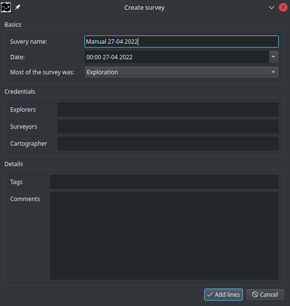
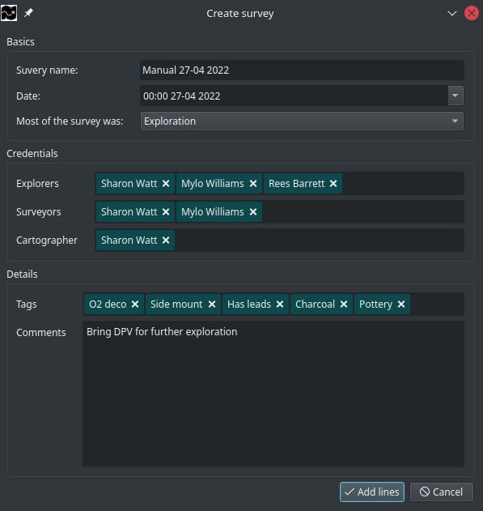
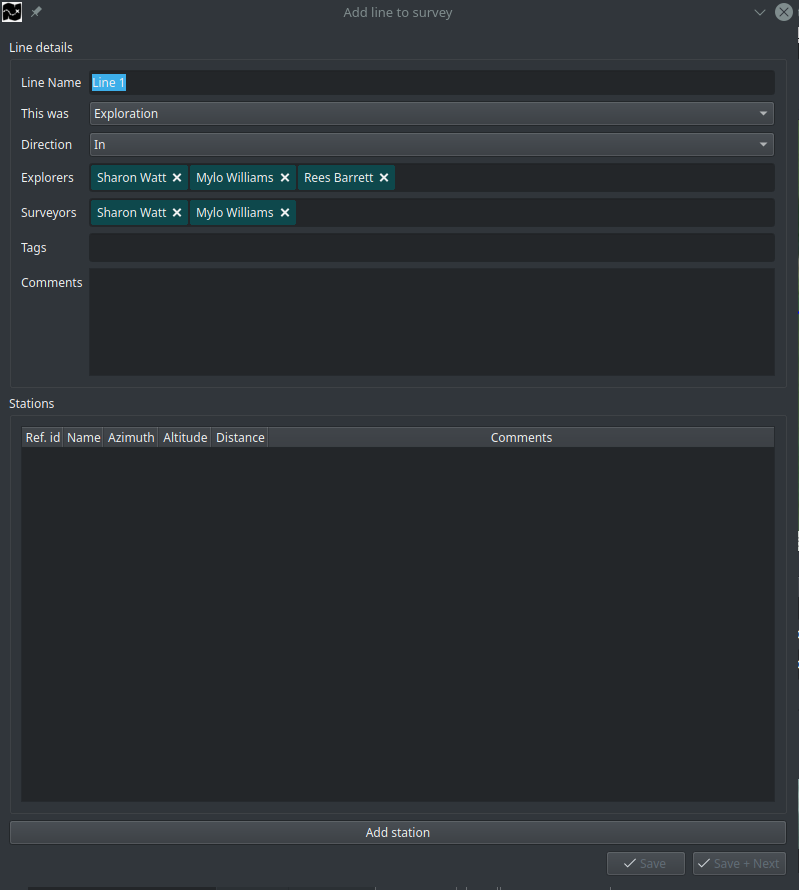
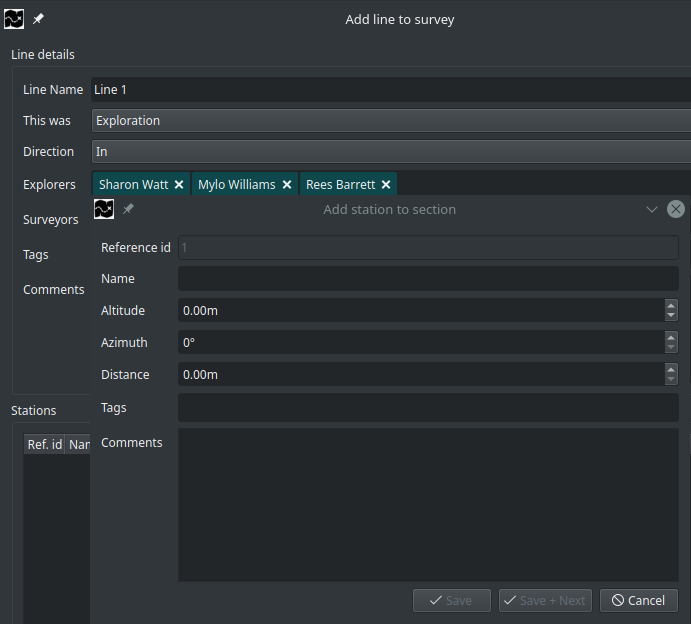
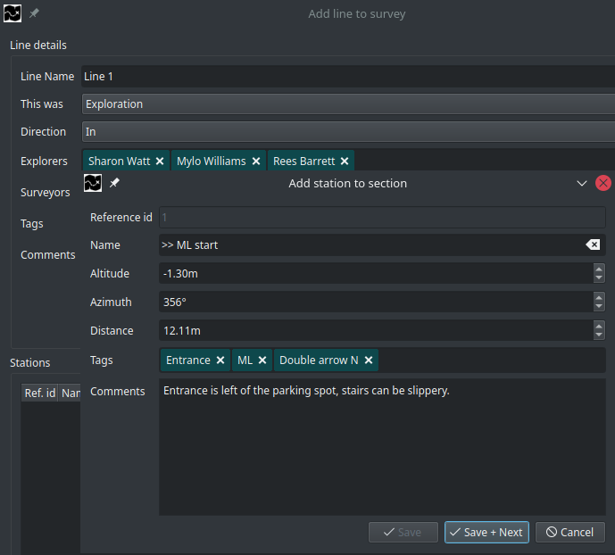
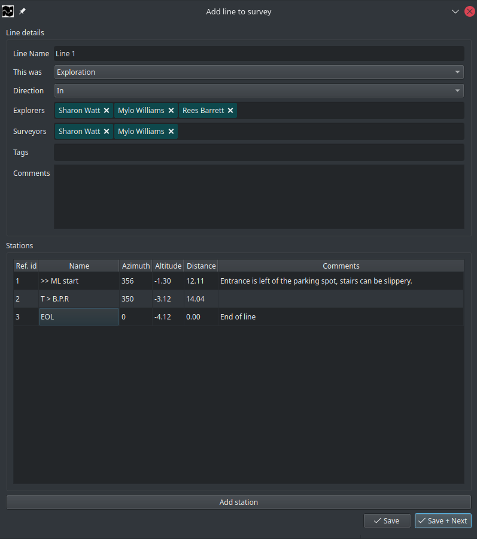
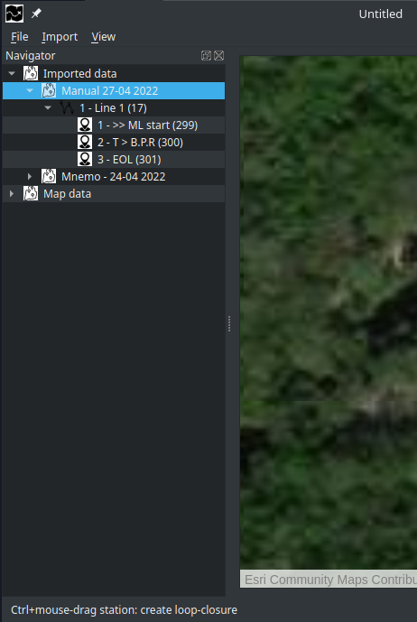

# Manual import
Open the manual import screen, from the main menubar select:

`Import -> Manual import` or use the keyboard shortcut: `Ctrl+i`

## Add survey details.
**StickMaps** orders your data by survey and stores the information about your survey for later use.
Al due all fields in this dialog are optional or prefilled, you will benefit from proving all data available to you.

*\*The wizard might look different on your computer depending on your operating system and desktop theme.*

### Basics
| Field name | Description | 
| ----------- | ----------- |
| Survey name | This will be the name under which you will see your survey in the navigator |
| Date | The date of when the survey took place | 
| Most of the survey was | Did you do mainly exploration or re-survey  |

### Credentials
| Field name | Description |
| ----------- | ----------- |
| Explorers | The name(s) of the (original) explorers |
| Surveyors | The name(s) of the person(s) gathering the survey data for this survey |
| Cartographer | The name(s) of the person(s) adding the data to **StickMaps** |

### Details
| Field name | Description |
| ----------- | ----------- |
| Tags | Tags are used for searching and grouping, add tags as you see fit it helps you finding specific surveys. |
| Comments | Anything specific about this survey you wish to remember |

## Verify your data
After providing all data, the dialog should look something like this:

*Note that all the green text-blocks (credentials & tags) will be available for autocomplete on future uses.*

After providing all available data,  Click `Add lines` to continue with adding your data.

## Add line
Based on the given survey example, the add line dialog should look something like this:

As you can see various fields have automatically been copied from your survey data ("this was", "explorers" and "Surveyors").
**StickMaps** always tries to minimize the amount of data for you to enter.

### Line details
| Field name | Description |
| ----------- | ----------- |
| Line name | This will be the name under which you will see your line in the navigator |
| This was | Was this line new exploration, re-survey or something else? |
| Direction | Did you survey on the way IN or on the way OUT? |
| Explorers | The name(s) of the (original) explorers |
| Surveyors | The name(s) of the person(s) gathering the survey data for this line |
| Tags | Tags are used for searching and grouping, add tags as you see fit it helps you finding specific lines. |
| Comments | Anything specific about this line you wish to remember |

### Stations
All stations you add for this line will be displayed in this table. You can use the scrollbar to navigate through them.
To add a new station click `Add station`

## Add station
A new dialog will pop-up on top of your add-line dialog:

| Field name | Description |
| ----------- | ----------- |
| Reference id | Automated, non-changeable station id |
| Name | A user defined name for the station |
| Altitude | The altitude of the measurement, **be aware** that as a cave diver you most probably have to provide **Negative value** here |
| Azimuth | Your compass heading towards the next station |
| Distance | The distance towards the next station |
| Tags | Tags are used for searching and grouping, add tags as you see fit it helps you finding specific stations. |
| Comments | Anything specific about this station you wish to remember |

Note that you should fill all unit-of-measurements in either metric or imperial depending on your preferences.
**StickMaps** internally and by default uses Metric for measurements, you can change this within the preferences `Ctrl+,`

### Verify your station
After filling the station-dialog with your data, it should look something like:

A line requires at least 2 stations, for this reason it is not possible to "save" your station without adding another one.
As so, click "Save+Next" and repeat the process until all stations for this line are created.

*\*please note: That the last station does not have an Azimuth neither should it have a distance, you should leave those fields blank*

## Save your line
Following our example, you should see the following dialog.

In case of a mistake in one of your stations, you can double click the column in the table overview and change the required value.
Remember that you can always change data after finishing this wizard.

Depending on your survey you can now save and add a new line (`Save + next`) or as with this example, save our line and complete our import (`Save`)

After clicking `Save` the Wizard will close and your survey should now be visible within the main navigator (`View -> toggle Navigator` or `Ctrl+Space`)

