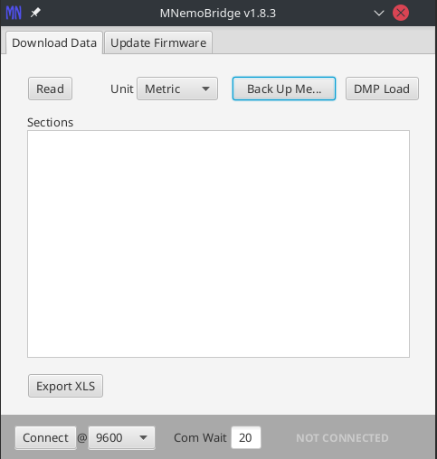
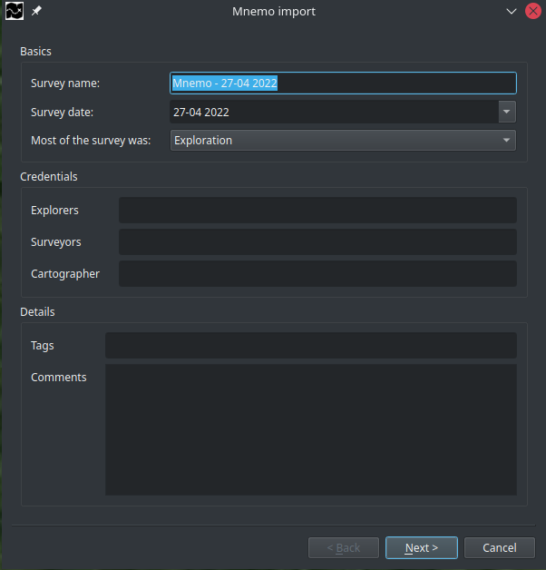
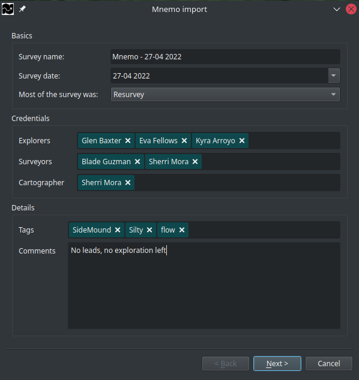
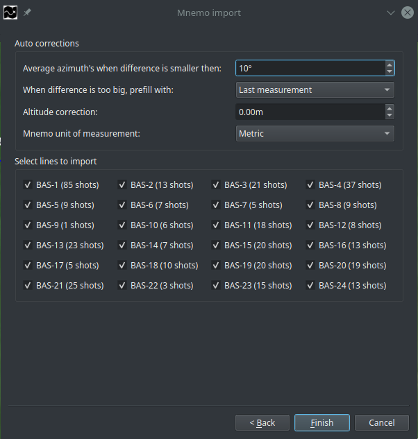

# Mnemo import
Due to some technical limitations we are not able to support a trustworthy connection between **StickMaps** and your Mnemo.

## MnemoBridge
You will need to install MnemoBridge in order to save your data to a .dmp file.
You can download this for free from the official Mnemo website.

1) Click the `Connect` button after your Mnemo is connected to your computer and is turned on.
2) Wait until your device is connected.
3) Click `Read` to read the contents of the device.
4) Click the `Back Up Me...` button to store the data from your device to a .dmp file.

*\*For further assistance or support with your Mnemo or MnemoBridge, please contact your Mnemo supplier*

## Import your .dmp file in StickMaps 

Open the Mnemo import screen, from the main menubar select:

`Import -> Mnemo dmp-file` or use the keyboard shortcut: `Ctrl+M`

## Select your file

After choosing your dmp file, **StickMaps** will attempt to read the data provided.
Al due in most instances this will work correctly, there are instances in where **StickMaps** is not able to read the file provided.
**StickMaps** is able to recover from multiple flaws in the file-format but can unfortunately not recover missing data.
This is a known problem and is a result of a faulty export within MnemoBridge that most likely happens on older computers.
A possible fix is to close all programs on your computer, disconnect from the internet, disconnect your Mnemo, restart MnemoBridge and try again.
If this does not work, please contact the supplier of your Mnemo, we can unfortunately not help you.

## Add survey details.
**StickMaps** orders your data by survey and stores the information about your survey for later use.
Al due all fields in this dialog are optional or prefilled, you will benefit from proving all data available to you.

*\*The wizard might look different on your computer depending on your operating system and desktop theme.*

### Basics
| Field name | Description | 
| ----------- | ----------- |
| Survey name | This will be the name under which you will see your survey in the navigator |
| Date | The date of when the survey took place | 
| Most of the survey was | Did you do mainly exploration or re-survey  |

### Credentials
| Field name | Description |
| ----------- | ----------- |
| Explorers | The name(s) of the (original) explorers |
| Surveyors | The name(s) of the person(s) gathering the survey data for this survey |
| Cartographer | The name(s) of the person(s) adding the data to **StickMaps** |

### Details
| Field name | Description |
| ----------- | ----------- |
| Tags | Tags are used for searching and grouping, add tags as you see fit it helps you finding specific surveys. |
| Comments | Anything specific about this survey you wish to remember |

## Verify your data
After providing all data, the dialog should look something like this:

*Note that all the green text-blocks (credentials & tags) will be available for autocomplete on future uses.*

After providing all available data,  Click `Next` to continue the process.

## Import preferences

