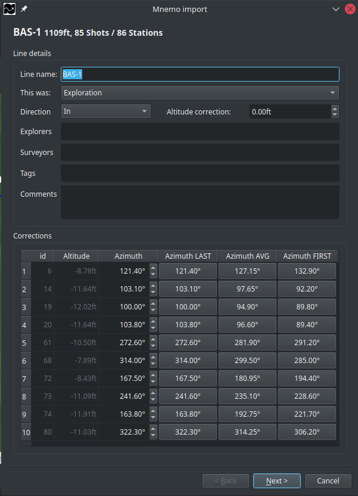

# Mnemo import

## Introduction
### Stations VS Shots
**StickMaps** and Mnemo have a fundamental different perspective on your survey data that you need to be aware of.
- Your Mnemo measures and stores the line between 2 stations called a shot. A station is just the start or the end of the shot. 
- **StrickMaps** stores stations and calculates the line between two stations.

In order to avoid confusion or mis-identifying stations there is a simple rule that will help you do so:

1) Always write the number displayed BETWEEN 2 shots in your wet-notes. (before taking the second azimuth)
2) When logging the last station of a line, finish your measurement and write down the number shown just before you turn your Mnemo off.
3) If when entering data into **StickMaps**, you miss a station, most probably you accidentally removed the last measurement when turning the device off.

If your stick to this strategy, the "(reference) id" of a station will always match the number writing in your wet-notes.

### No direct connection
Due to technical limitations we are not able to support a direct connection between **StickMaps** and your Mnemo.
Instead, **StickMaps** imports the backup file (*.dmp) exported by MnemoBridge.

## MnemoBridge
You will need to install MnemoBridge in order to save your data to a .dmp file.
You can download this for free from the official Mnemo website.

1) Click the `Connect` button after your Mnemo is connected to your computer and is turned on.
2) Wait until your device is connected.
3) Click `Read` to read the contents of the device.
4) Click the `Back Up Me...` button to store the data from your device to a .dmp file.

*\*For further assistance or support with your Mnemo or MnemoBridge, please contact your Mnemo supplier*

## Import your .dmp file in StickMaps 

Open the Mnemo import screen, from the main menubar select:

`Import -> Mnemo dmp-file` or use the keyboard shortcut: `Ctrl+M`

## Select your file

After choosing your dmp file, **StickMaps** will attempt to read the data provided.
Al due in most instances this will work correctly, there are instances in where **StickMaps** is not able to read the file provided.
**StickMaps** is able to recover from multiple flaws in the file-format but can unfortunately not recover missing data.
This is a known problem and is a result of a faulty export within MnemoBridge that most likely happens on older computers.
A possible fix is to close all programs on your computer, disconnect from the internet, disconnect your Mnemo, restart MnemoBridge and try again.
If this does not work, please contact the supplier of your Mnemo, we can not help you.

## Add survey details.
**StickMaps** orders your data by survey and stores the information about your survey for later use.
Al due all fields in this dialog are optional or prefilled, you will benefit from proving all data available to you.

*\*The wizard might look different on your computer depending on your operating system and desktop theme.*

### Basics
| Field name | Description | 
| ----------- | ----------- |
| Survey name | This will be the name under which you will see your survey in the navigator |
| Date | The date of when the survey took place | 
| Most of the survey was | Did you do mainly exploration or re-survey  |

### Credentials
| Field name | Description |
| ----------- | ----------- |
| Explorers | The name(s) of the (original) explorers |
| Surveyors | The name(s) of the person(s) gathering the survey data for this survey |
| Cartographer | The name(s) of the person(s) adding the data to **StickMaps** |

### Details
| Field name | Description |
| ----------- | ----------- |
| Tags | Tags are used for searching and grouping, add tags as you see fit it helps you finding specific surveys. |
| Comments | Anything specific about this survey you wish to remember |

## Verify your data
After providing all data, the dialog should look something like this:

*Note that all the green text-blocks (credentials & tags) will be available for autocomplete on future uses.*

After providing all available data,  Click `Next` to continue the process.

## Import preferences
Before reading the data from the file, **StickMaps** requires a few preferences to be defined.

| Field name | Description |
| ----------- | ----------- |
| Average azimuth's when difference is smaller then | A value between 10 and 20 percent is advised |
| When difference is too big, prefill with | Generally you will want to use "Last measurement", as most likely line replacement is the cause of the difference |
| Altitude correction | Mnemo incorrectly calibrated, offset the depth measurement here. (use a NEGATIVE value for depth) |
| Menmo unit of measurement | Mnemo dmp files present distances in the units as set within the Mnemo |
| Select lines to import | Allows you too only import the required line |

### Verify your data
After providing your preferences, click `Finish` to start the import.

## Verify lines
**StickMaps** Will parse the dmp file and verify every station inside it.
It is important to note that while Mnemo measures shots, **StickMaps** works with stations.
As a result, you will always have 1 station more than you will have shots.

### Line details
| Field name | Description |
| ----------- | ----------- |
| Line name | This will allow you to search and recognize your line within the navigator |
| This was | Was this line new exploration, re-survey or something else? |
| Direction | Did you survey on the way IN or on the way OUT? |
| Altitude correction | Use a NEGATIVE number for depth|
| Explorers | The name(s) of the (original) explorers |
| Surveyors | The name(s) of the person(s) gathering the survey data for this line |
| Tags | Tags are used for searching and grouping, add tags as you see fit it helps you finding specific lines. |
| Comments | Anything specific about this line you wish to remember |

### Corrections
This table will show every station that has an azimuth difference bigger then the value you specified at the 
previous page (`Average azimuth's when difference is smaller then`) and will give you 5 options.

1) Use the preset as specified at the previous page (`When difference is too big, prefill with`)
2) Change the value manually
3) Use the last measurement
4) Use the average of both measurements
5) Use the first measurement

| Column name | Description |
| ----------- | ----------- |
| id | The non-changeable of the station (remember that the numbers in your wet-notes are shots) *|
| Altitude | The altitude measured at the station |
| Azimuth | The azimuth as prefilled as specified on the previous page |
| Azimuth LAST | The azimuth of the LAST measurement of the current shot|
| Azimuth AVG | The average of both azimuths |
| Azimuth FIRST | The azimuth of the FIRST measurement of the current shot|

