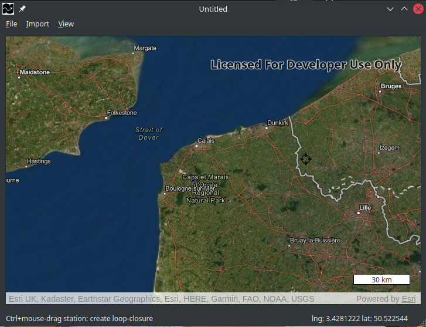
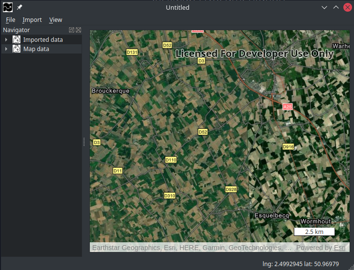

# Main interface
After creating your first **StickMaps** project, you will be presented with the following screen.

**StickMaps** has put most interaction within its `right-click` mouse menu's or keyboard-shortcuts to the top navigation bar.
For instance, probably the most used keyboard-shortcut `Ctrl+Space` will open the Navigator for you.

