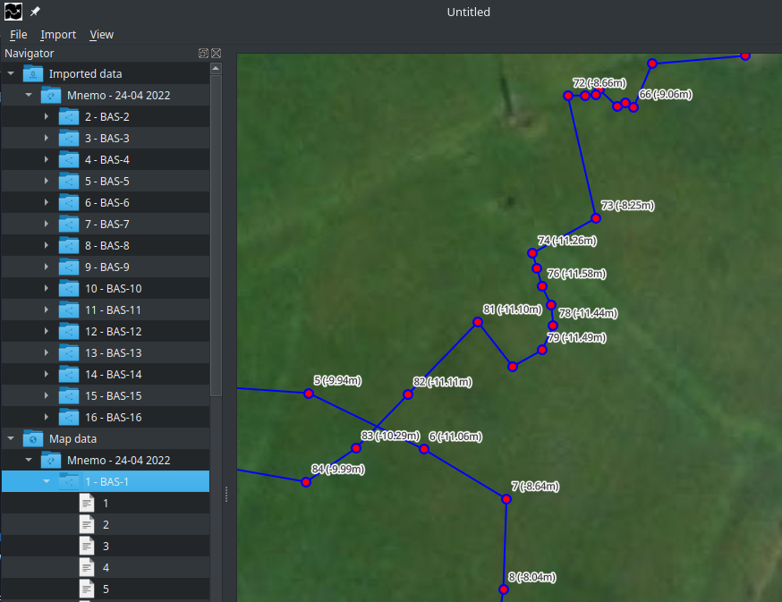
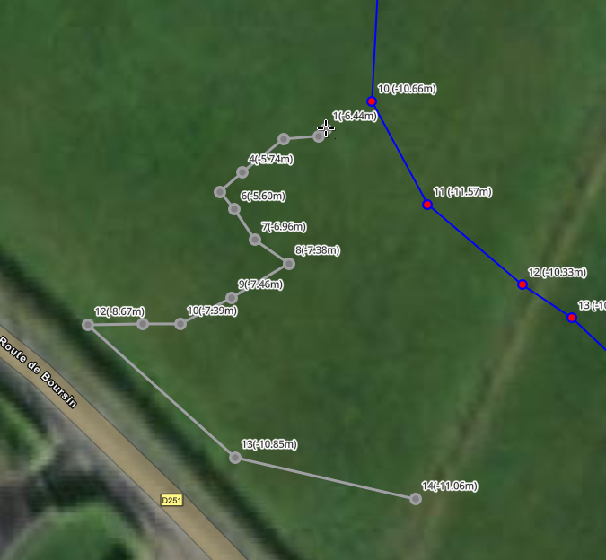
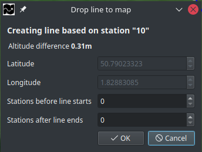
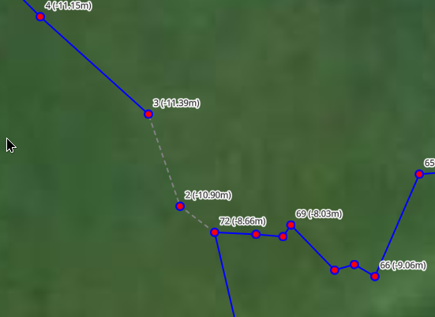

# Navigator
Apart from the map itself, the Navigator will be the interface element you use most.
You can show and/or hide the widget using `Ctrl+Space` or `View -> Toggle Navigator`

## Introduction
Your navigator is a directory-style representation of all your survey(-related) data within your project.
After importing your survey, you will find that survey within the navigator's "Imported data" folder.
Once a line is available on the map, it will automatically also be available within the navigator's `Map data` folder.
Everytime you drag a line from the `Imported data` folder to the map view, the line will be moved from the `Imported data` folder to the `Map data` folder.
After removing a line from the `Map data` folder or the map itself, it will show-up in the `Imported data` folder.

### Available actions
- `Double-click` folders to see their contents.
- `right-click` folders to show the context-menu displaying all available options.
- `left-click + mouse move` line-folders within the `Imported data` folder to drag them into the `Map window`
- `double click` stations-files to edit them.
- `right-click` station-files to show the context-menu displaying all available options.

## Imported data
This folder will hold all your imported surveys.

### Drag your line into the map-window.
All line-items found in the Navigator -> `Imported data` -> `[ypour survey]` folder, are draggable.
You can recognize these folders by the cursor changing to a "draggable cursor" when you hover them

 

When you hover your line, click and hold your left-mouse button en simply move your mouse towards the map-window.
You will see your line displayed on the mapview, following your mouse cursor where-ever you move it.

When your mouse hovers already existing stations on your map, it will compare its altitude with the line you are dragging.
If both are within a reasonable margin of each other* the existing station will light up indicating that you can connect your line to the given station.
When you drop your line on the map without an existing station lighting up, you will create an GPS based line.

*\*see `file -> preferences, Map -> Station max altitude difference`*

## Provide optional information

After dropping a line on the map, a dialog will show up.

| field name | description | available |
| ----------- | ----------- | --------- |
| Latitude | The latitude of the dropped station | Only editable when line is not connected to existing station |
| Longitude | The longitude of the dropped station | Only editable when line is not connected to existing station |
| Stations before line starts | When your line starts with a jump or reel, how many stations are connected with a temporary line? | Always available |
| Stations before line ends | When your line ends with a jump, how many stations are connected with a temporary line? | Always available |

### Stations before line starts / Stations before line ends
Temporary lines will be displayed in a dotted grey line, making jumps or reelings instantly visible.
The example below shows a line where "Stations before line starts " is set to 2.
 

## Map data
This folder will hold all your items displayed on the map.
As sometimes it is easier to find and/or access your items through the navigator rather then directly on the map **StickMaps** allows you to do so.

### Editing stations
It is currently not possible to edit position related data for a station that exists on the map.
Future versions of **StickMaps** will most likely do support such a feature.

### Center station on map
`Right-click` a station and select `goto Station`, your station should now be centered on the map window.

